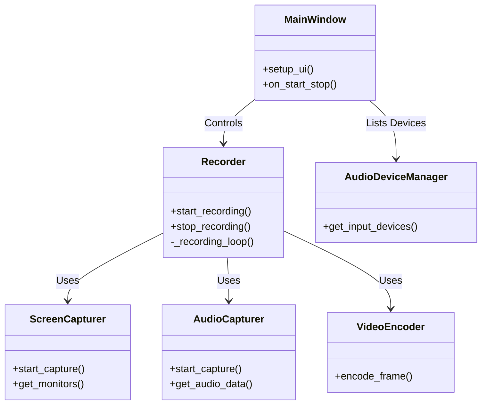
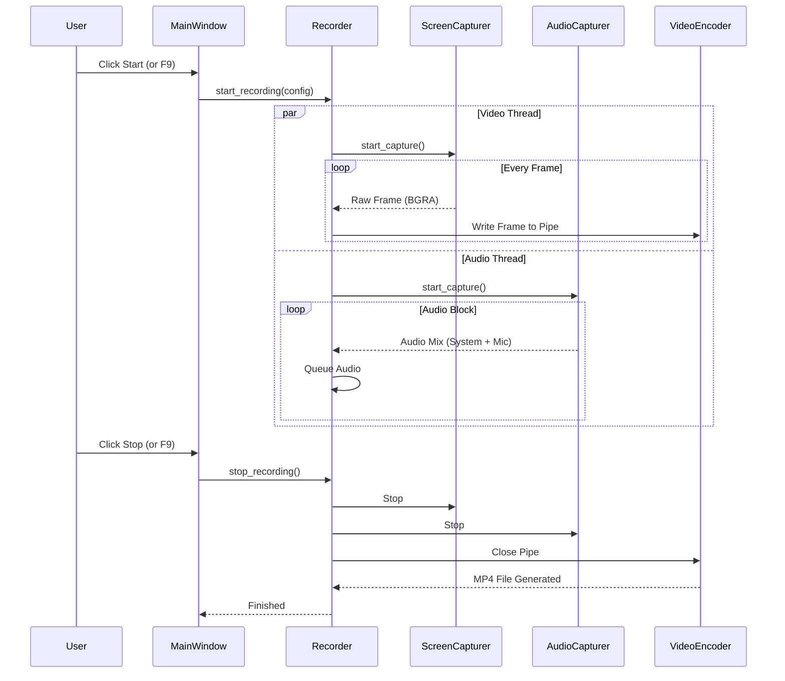

# Screen Recorder (画面録画ツール)

ナレーション付きチュートリアル動画作成などに最適な、シンプルかつ高機能なWindows用画面録画アプリケーションです。
Python + PyQt6 で構築されており、FFmpegを使用した高品質な録画が可能です。

## 主な機能

- **高度な録画モード**
  - **全画面録画**: マルチモニター対応。録画したいモニターを選択して録画できます。
  - **範囲指定録画**: マウスドラッグで任意の矩形範囲を指定して録画できます。
- **柔軟な保存形式**
  - **MP4**: 高画質・低負荷なH.264形式で保存。
  - **GIF**: オプションでGIFアニメーションとして保存可能（自動変換）。
- **モダンなUI / UX**
  - **ダークテーマ**: 目に優しいモダンなダークテーマを採用。
  - **視覚的な操作**: アイコン付きのボタンで直感的に操作可能。
  - **ビジュアルフィードバック**: 録画中のステータス変化を色とアイコンで明確に表示。
- **柔軟な音声録音**
  - **システム音声**: PCから出る音（YouTubeやゲーム音など）をクリアに録音 (WASAPI Loopback対応)。
  - **マイク音声**: ナレーションなどのマイク音声を同時録音。
  - **ミキシング**: システム音とマイク音を自動的にミックスして保存します。
- **便利なコントロール**
  - **ホットキー**: グローバルホットキー (F9: 開始/停止, F10: 一時停止/再開) で、他のアプリを操作しながら制御可能。

## 動作環境

- Windows 10 / 11
- Python 3.10 以上
- **FFmpeg**: 必須 (環境変数 PATH に通してください)

### 依存ライブラリ
- PyQt6
- mss (高速スクリーンキャプチャ)
- soundcard (システム/マイク音声キャプチャ)
- numpy
- ffmpeg-python
- keyboard (グローバルホットキー)
- qtawesome (UIアイコン)

## インストール手順

1. **FFmpegのインストール**
   - [FFmpeg公式サイト](https://ffmpeg.org/download.html)からWindows版をダウンロード＆解凍。
   - `bin` フォルダへのパスをWindowsの環境変数 `PATH` に追加します。

2. **リポジトリのクローンとライブラリのインストール**
   ```bash
   git clone <repository-url>
   cd screen_recorder
   pip install -r requirements.txt
   ```

## 使い方

1. アプリケーションの起動:
   ```bash
   python main.py
   ```
   > **Note**: 必ず `python main.py` で実行してください。依存関係のパッチ適用のため、エントリーポイントからの起動が必須です。

2. **設定**:
   - **モード**: 「全画面録画」か「範囲指定録画」を選択。全画面の場合は対象モニターを選びます。
   - **音声**: 必要に応じて「システム音声を録音」「マイク音声を録音」にチェックを入れます。
   - **保存形式**: 「GIFとしても保存」にチェックを入れると、MP4の代わりにGIF形式で保存されます。

3. **操作**:
   - **F9**: 録画開始 / 録画停止 (保存)
   - **F10**: 一時停止 / 再開

## 技術アーキテクチャ

本アプリケーションは、各機能を独立したモジュールとして管理し、`Recorder` クラスがそれらを統括する設計になっています。

### クラス構成図 (Class Diagram)



### 処理シーケンス (Sequence Diagram)

録画開始から終了までのデータフローは以下の通りです。並列スレッドで映像と音声をキャプチャし、パイプラインを通じて処理します。



## トラブルシューティング

- **音声録音のエラー**:
  - 本アプリは `soundcard` ライブラリを使用しており、Windows環境における `numpy` の互換性問題を解決するためのランタイムパッチ (`core/soundcard_patch.py`) が起動時に適用されます。
  - エラーが出る場合は、必ず `python main.py` から起動しているか確認してください。

- **画面が真っ黒**:
  - マルチモニター環境での座標ズレ対策済みですが、もし発生した場合は「範囲指定録画」で再度範囲を選択し直してみてください。
